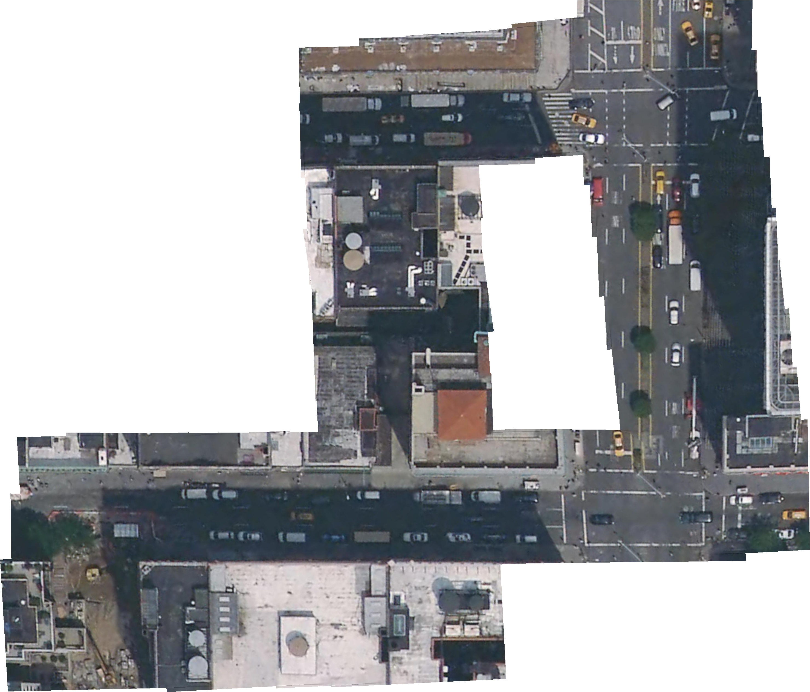

# Perception Final Project



## Introduction

The following program is a modified version of the Project OpenPano by Yuxin Wu of Facebook AI research. 

### Compile Dependencies:

* gcc >= 4.7 (Or VS2015)
* [Eigen](http://eigen.tuxfamily.org/index.php?title=Main_Page)
* [FLANN](http://www.cs.ubc.ca/research/flann/) (already included in the repository, slightly modified)

@Prof Chen I hope you are using Ubuntu 

On Ubuntu, install dependencies by: `sudo apt install build-essential sed cmake libjpeg-dev libeigen3-dev`

### Compile:
#### Linux 

```
$ mkdir build && cd build && cmake .. && make
```

#### Windows
* I haven't tested the code on Windows. But I am sure if the dependencies are met the code will work just fine.


### Run:

@ Prof. Chen Please run the following Script file to take to make the whole process of running much easier.
```
$ ./load.sh
```

The output file is ``out.jpg``. You can play with the [example data](https://github.com/ppwwyyxx/OpenPano/releases/tag/0.1) to start with.


## Speed & Memory:
Tested on Intel Core i9-8950HK

+ 41 ordered images of size 640x480: 1.4s.

## Algorithms
+ Features: [SIFT](http://en.wikipedia.org/wiki/Scale-invariant_feature_transform)
+ Transformation: use [RANSAC](http://en.wikipedia.org/wiki/RANSAC) to estimate a homography or affine transformation.
+ Optimization: focal estimation, [bundle adjustment](https://en.wikipedia.org/wiki/Bundle_adjustment), and some straightening tricks.

For details, I have mentioned the working of code as well as some other relevant theory I understood during the Robot Perception Class

## References

[111](http://en.wikipedia.org/wiki/Scale-invariant_feature_transform)